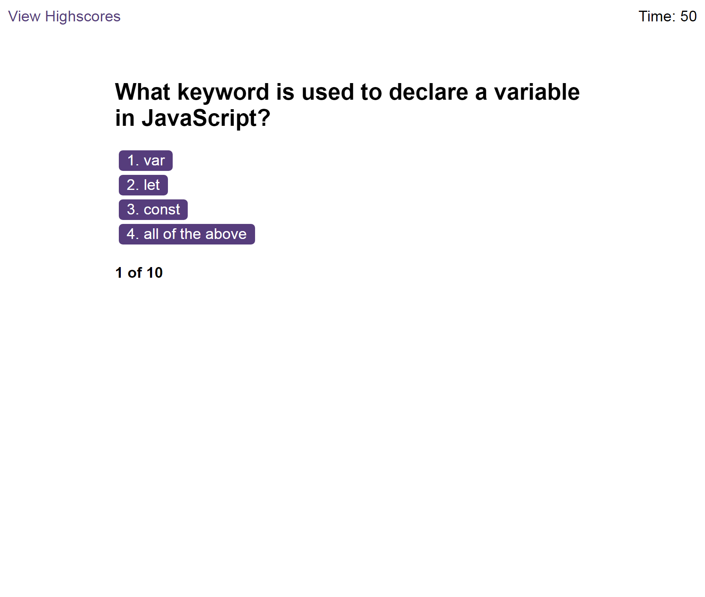
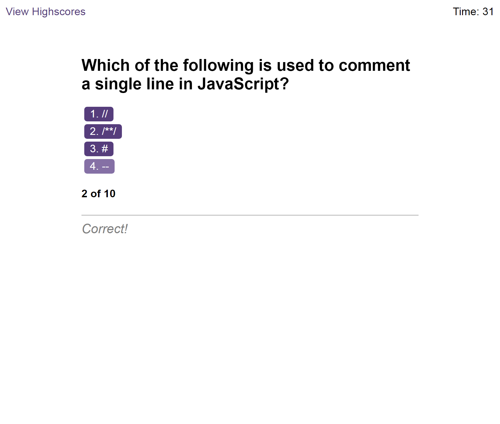
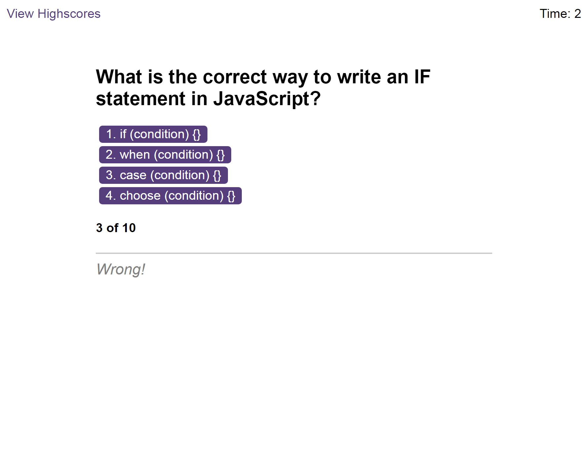
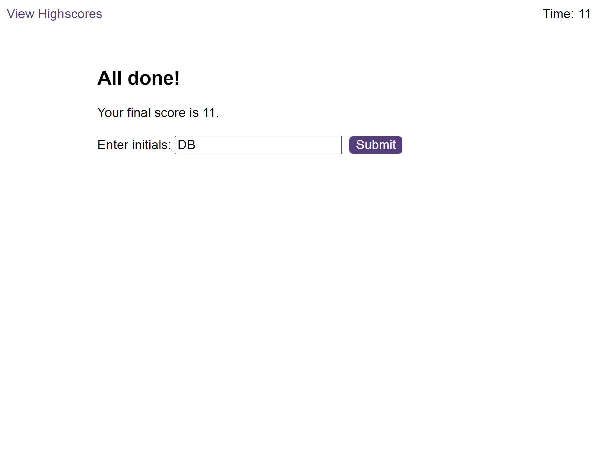
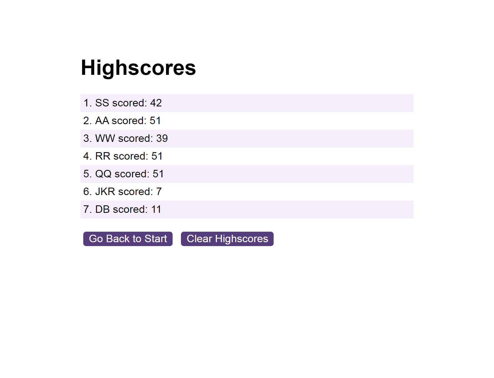
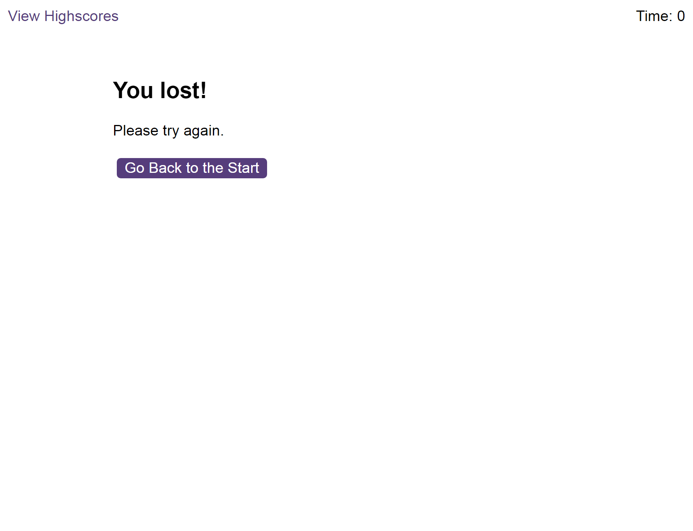

# Code-Quiz
A timed interactive quiz built with JavaScript. Can you answer the questions before the timer hits zero?

## **User Story**

When the 'Start Quiz' button is pressed the countdown starts and the first multiple choice question is displayed. 
If the user selects the correct answer the next question is displayed. 
If they choose the wrong answer then 5 seconds is knocked of the timer and the next question is displayed. 
If the user answers all the questions within the time limit then the remaining time is recorded as their score and they can enter their initials.
The high-scores will be displayed in a table.

## **Site Link**

Visit my Quiz page here:  https://brooksy236.github.io/Code-Quiz/

## **Screenshots**

## **Installation**

_N/A_

## **Usage**

Click 'Start Quiz' and answer the questions.

## **License**

MIT License

